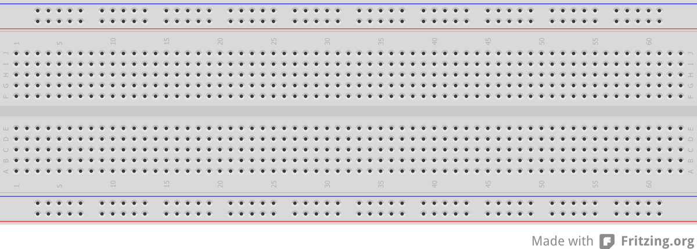

# Introduction

This project is designed to show the internal workings of computer.

Topics that will be covered, include:

- Machine Language
- The Central Processing Unit (CPU)
  - How a CPU performs its operations
  - Instruction Fetch-Execute sequence
  - How they are implemented
- The Control Unit
- Random Access Memory (RAM)
- Data Storage

Due to the nature of this project, this manual is subject to change over time to adapt to the progress of the students.

In this project you will be building a simple computer with a central processing unit with support for a few instruction and some memory. The instructions that will be built are simple operations such moving data between registers and performing simple addition operations.

By the end of the project, your computer should be able to demonstrate the operation of the following program:

```AsciiDoc
MOV A, B
INC B
MOV B, A
INC B
```

# Project Componenents

## Power Supply

In this project, we will be using a standard 5 volt direct current power supply. We will be using the positive connection to connect to our supply rail called `VCC` and is by convention red. The negative connection will connect to our reference rail called ground or `GND` and is by convention black but may appear at times in blue.

In this lab, we will use `VCC`, `5V` and `+5V`

## Breadboard

In this project, we will be using a prototyping project board more commonly known as a breadboard.

[](breadboard.svg)


## Wires
## Integrated Circuit Chips
## Passive Components
### Resistor
### Capacitor
## Light Emitting Diodes
## Switches

# Data Representation

Inside the computer, we need a way of representing information, however, the only means we have is through wires. The information we can store on a wire is called a bit and is the absence or presence of a voltage relative to a common reference. The convention we have adopted is that the presence of a voltage represents a logical `1` and the absence of a voltage represents a logical `0`

## Binary

Decimal | Binary
:-:|:-:
0 | `0000`
1 | `0001`
2 | `0010`
3 | `0011`
4 | `0100`
5 | `0101`
6 | `0110`
7 | `0111`
8 | `1000`
9 | `1001`
10 | `1010`
11 | `1011`
12 | `1100`
13 | `1101`
14 | `1110`
15 | `1111`

# Logic Gates


# Description of Chips Used

The part numbers on the chips may vary from chip to chip. For this project, the parts have been picked so that you may ignore the letters in the part number. This means the parts SN74HCT04 and 74LS04 would be referred to simply as 7404 and perform the same task.

## 555 Timer

The 555 Timer Chip is a chip used to generate various output waveforms, for our purpose, we will be using it to generate out clock signal the Clock Signal Generator lab. In depth knowledge of this chip is not needed for this course however more information can be found on the [555 Timer IC Wikipedia page](http://en.wikipedia.org/wiki/555_timer_IC).

```AsciiDoc
        .-._.-.
 GND   [|     |]   VCC
TRIG   [| 555 |]   DIS
 OUT   [|     |]   THR
~RES   [|     |]   CTRL
        '-----'
```

- `VCC`: +5V Supply Voltage
- `GND`: Ground
- `OUT`: Output waveform
- `TRIG`, `RES`, `CTRL`, `THR`, `DIS`: This pins determine how the chip should generate its output waveform.

## 7404 NOT Gate (x6)

The 7404 is a chip which contains 6 NOT gates also know as inverters.

`Yn` = ~`An`

```AsciiDoc
        .-._.-.
  A4   [|     |]   VCC
  Y4   [| 74  |]   A1
  A5   [|  04 |]   Y1
  Y5   [|     |]   A2
  A6   [|     |]   Y2
  Y6   [|     |]   A3
 GND   [|     |]   Y3
        '-----'
```

- `VCC`: +5V Supply Voltage
- `GND`: Ground
- `A#`: Input for correspondingly numbered gate
- `Y#`: Output for correspondingly numbered gate

## 7408 AND Gate (x4) 

The 7408 is a chip which contains 4 AND gates.

`Yn` = `An` &and; `Bn`

```AsciiDoc
        .-._.-.
  A3   [|     |]   VCC
  B3   [| 74  |]   A1
  Y3   [|  08 |]   B1
  A4   [|     |]   Y1
  B4   [|     |]   A2
  Y4   [|     |]   B2
 GND   [|     |]   Y2
        '-----'
```

- `VCC`: +5V Supply Voltage
- `GND`: Ground
- `A#`: First Input for correspondingly numbered gate
- `B#`: Second Input for correspondingly numbered gate
- `Y#`: Output for correspondingly numbered gate

## 7432 OR Gate (x4)

The 7432 is a chip which contains 4 OR gates.

`Yn` = `An` &or; `Bn`

```AsciiDoc
        .-._.-.
  A3   [|     |]   VCC
  B3   [| 74  |]   A1
  Y3   [|  32 |]   B1
  A4   [|     |]   Y1
  B4   [|     |]   A2
  Y4   [|     |]   B2
 GND   [|     |]   Y2
        '-----'
```

- `VCC`: +5V Supply Voltage
- `GND`: Ground
- `A#`: First Input for correspondingly numbered gate
- `B#`: Second Input for correspondingly numbered gate
- `Y#`: Output for correspondingly numbered gate

## 7442 Decoder
## 74164 Shift Register
## 74189 64bit Memory (16x4)
## 74283 4bit Adder
## 74395 4bit Register

# Project 

## Introductory Labs

### Equipment and Data Representation

In this lab, we will introduce ourselves to the equipment in the lab. We will also look at what is required to represent data electrically and how to get output from it. We will set up a simple circuit to produce data values with a switch, visualize the value with an LED and then use the value produced as an input to a logic gate and then visualize the output of a logic gate.

You will have been issued a lab kit containing:

- A project board
- A power supply
- A wire cutting and stripping tool
- A chip removing tool

The project kits issued this year have the project board integrated with the powersupply, an additional breadboard is also included in case you run out of space on your project board later on in the lab.

#### Before You Begin

This is a lab which deals with electricity, your lab demonstrator should have given you a quick talk about the safety of dealing with electricity. While the volage and current levels are not high enough to cause serious injury to anyone caution must still be taken with this equipment. The equipment may also become damaged if wired improperly. If at any point you are not sure about the setup of your project board, call over your lab instructor.

__If something is not working or components become hot, turn off the power.__ Look for the issue or call over your lab instructor if needed.

__IF YOU SMELL SMOKE OR BURNING, CUT THE POWER ON YOUR POWER SUPPLY IMMEDIATELY AND CALL OVER YOUR LAB INSTRUCTOR!__

#### Steps

1. Take out your project board from the kit that was issued to you, verify that it works

### Circuits using Logic ICs (Half Adder)

In this lab, we will look at the circuits involved in forming logical equations. The circuit we will be using is called the half-adder which is used for adding two bits together to get a result.

In using two bits, we need two inputs, one to represent each bit. Because we are using the binary number system, we can potentially end up with two digits in the result since our addition overflows or carries into another digit (in the case of 1+1). This means we will need two outputs to represent the result.

We will be representing our inputs as A and B and our outputs as C and S. S will be the sum of the two digits and C will be the value that carries over.

```
  A
+ B
---
 CS
```
In order to construct our circuit, we will need to know the equation that represents each bit in the result. To do this, we can construct a truth table which can help us in determining the equations.

| A | B | C | S |
|:-:|:-:|:-:|:-:|
| 0 | 0 | 0 | 0 |
| 0 | 1 | 0 | 1 |
| 1 | 0 | 0 | 1 |
| 1 | 1 | 1 | 0 |

The derived equations are constructed from the primitive boolean algebra operations AND OR and NOT. These operations have corresponding logical gates which are available as DIP chips in the lab.

- The NOT gate is part number 7404
- The AND gate is part number 7408
- The OR gate is part number 7432

Reminder:
- The part numbers on the chip may vary from chip to chip so ignore the letters.
- SN74HCT04 would be referred to simply as 7404.

#### To include in the lab report

- The equations that you have derived for the half-adder.
- A gate diagram for those equations.
- A truth table for a full-adder circuit

## Project Labs

### System Clock / Clock Signal Generator
### Buses and Registers
#### Flip Flops
#### Tri-State Buffer
### Memory
### Control Unit
### Running a Program

# Test Area

```AsciiDoc
        .-._.-.
       [|     |]
       [|     |]
       [|     |]
       [|     |]
       [|     |]
       [|     |]
       [|     |]
       [|     |]
        '-----'
```

## [555 Timer IC](http://en.wikipedia.org/wiki/555_timer_IC)
```AsciiDoc
        .-._.-.
 GND   [|     |]   VCC
TRIG   [| 555 |]   DIS
 OUT   [|     |]   THR
~RES   [|     |]   CTRL
        '-----'
```
